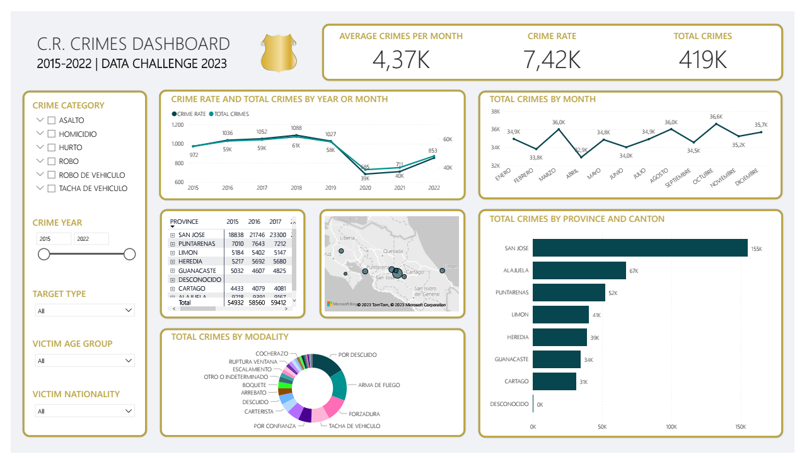

# Crimes Data Pipeline

## Summary

This business intelligence solution leverages Snowflake and Power BI capabilities to create a dashboard for analyzing a crimes dataset from Costa Rica. The ETL pipelines were built using only SQL and used Snowflake objects such as pipe, stream, and task. The data was structured into a star schema on Snowflake and the resulting dashboard was designed using Power BI. This provides a streamlined and efficient solution for analyzing the crimes dataset, making it easier to gain insights and make informed decisions.

## Dashboard

## Data Model

## Architecture

### Considerations

- The architeture is comprised of three layers: raw, transformed and consumption.
- Each layer is a schema on Snowflake.

### Flow

1. User uploads csv files to an S3 bucket, which is integrated with Snowflake as an external stage.
2. Pipe object with auto-ingest enabled executes the "COPY INTO ..." command to move the raw data from the external stage to the crimes table in the raw layer.
3. The append-only changes made by the pipe object are captured by the stream linked to the RAW.CRIMES table.
4. A recurring scheduled task checks the stream linked to the RAW.CRIMES table to pull any new data, if that's the case, then data is moved from RAW.CRIMES to TRANSFORMED.CRIMES with some transformations on the columns and data types.
5. The append-only changes made by the pipe object are captured by the stream linked to the TRANSFORMED.CRIMES table.
6. A recurring scheduled task checks the stream linked to the TRANSFORMED.CRIMES table to pull any new data, if that's the case, then data is moved from TRANSFORMED.CRIMES to all the other tables in the consumption layer that make up a star schema using the data pipeline described below.

## DAGs

- The following objects were used for the data pipeline on Snowflake: Pipe, Stream and Task.
- The main DAG in charge of filling the tables in the star schema can be seen in the figure below.

